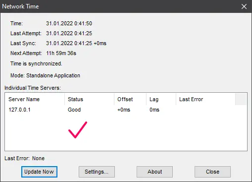
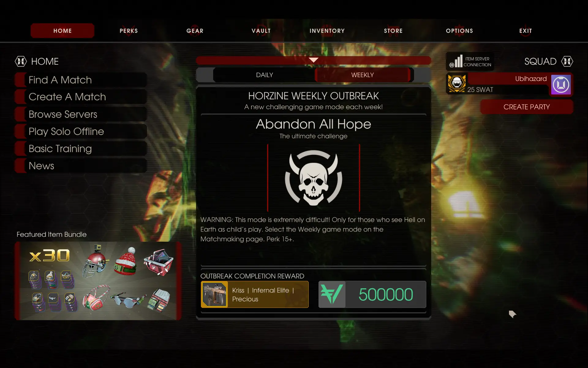
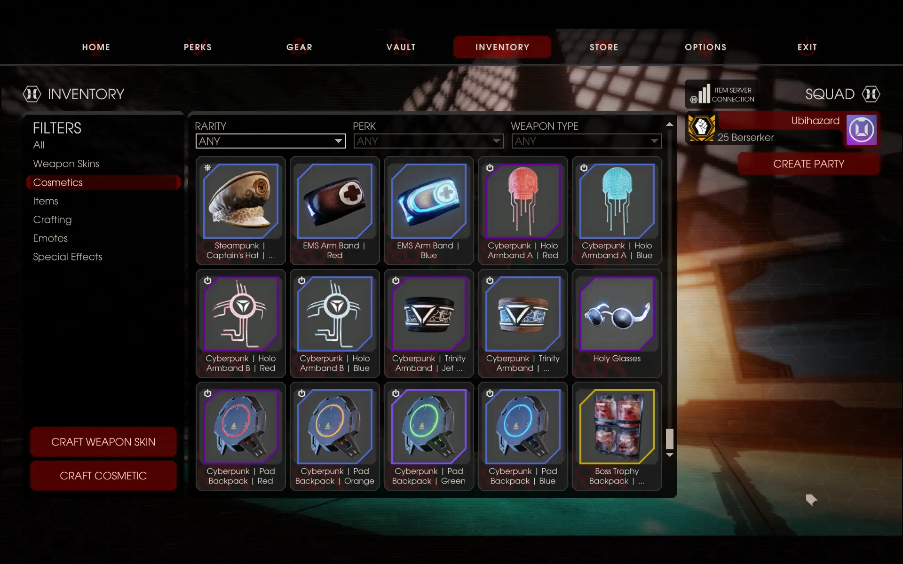

<p align="center"></p>
<h1 align="center">Killing Floor 2 Dedicated Outbreaks</h1>

<!--
Killing Floor 2 Dedicated Outbreaks
===================================


-->

*This [Steam guide](https://steamcommunity.com/sharedfiles/filedetails/?id=2738425105 "View") had to be reposted here on GitHub because apparently some degenerate with moderator permissions on Steam, or some automated system, kept messing it up, for unknown reason.*

**Update 3:** with the official release of fall 2023 update, this workaround doesn’t appear to work anymore. Developer has implemented additional checks to prevent match from starting. There’s also an issue with profile loading after activating time spoofing. This guide and this page will be kept for archival purposes. It’s going to take **a lot** of time to collect all weekly rewards now if you didn’t take advantage of this method while it was still working.

**Update 2:** Fall 2023 update *finally* adds weekly mode selector to play any mode anytime you want. *However,* you would still unlock reward *only for the currently scheduled weekly...* Therefore it is useless if you want to unlock several weekly rewards ahead of time. So this guide is still relevant.

**Update 1:** this guide is still relevant in 2022 as no fix to remedy the situation has been released yet.

A guide to play any weekly outbreak any time you want. This guide will be useful to anyone still playing [Killing Floor 2](https://wiki.killingfloor2.com/index.php?title=Main_Page "Wiki"). It is still relevant in 2022 as no fix to remedy the situation has been released yet.

Weekly Outbreaks
----------------

As you all know, the weekly outbreaks are a set of special mutations for regular Survival game mode which were introduced as a part of the 2017 Summer Sideshow update. Originally restricted to just eight mutations, the list has since then doubled to sixteen through updates introduced last year.

With this came the problem of actually being able to play a desired weekly. Survival Weekly game mode follows an automatic pre-configured rotation and does not allow one to just start any weekly they want at moment’s notice. This means that if you miss a certain outbreak, you would have to wait a whopping 15 weeks before it reaches its rotation and becomes playable again. Unfortunately, the developers did not provide any QoL improvement to this situation so far, even solo offline.

Luckily, I’ve discovered a way to circumvent this restriction locally. Killing Floor 2 uses internet time servers to obtain precise time and choose the appropriate weekly from rotation. The trick is to set up your own time server configured with time ahead in the future, a dedicated server running in Weekly Survival game mode, and redirect time requests made by KF2 to your own machine instead of internet. This will effectively cause both the server and the game client to switch to a different weekly, or the one you want it to use. The method described in this guide is completely legitimate and allows you to earn weekly rewards by completing them in a usual manner in a solo multiplayer game on your own dedicated server.

*__Update:__ looks like it is no longer necessary to install dedicated server in order to be able to obtain weekly rewards. The whole [“Setting Up Killing Floor 2 Dedicated Server”](https://github.com/ubihazard/kf2-dedicated-outbreaks#setting-up-killing-floor-2-dedicated-server) step can be thus skipped. Continue with the [“Setting Up Local SNTP Time Server”](https://github.com/ubihazard/kf2-dedicated-outbreaks#setting-up-local-sntp-time-server) step and simply choose “Solo Offline” and the “Weekly” game mode after Killing Floor 2 loads up. The dedicated server portion of this guide will be preserved for reference or in case if it’s needed again.*

The whole process is incredibly complicated, but doable. This guide assumes an experienced user so please, don’t attempt this guide if you find installing and configuring a dedicated server to be a difficult task.

Still not feeling intimidated? Let’s go on then.

Setting Up Killing Floor 2 Dedicated Server
-------------------------------------------

Create `C:\KF2Server` and `C:\SteamCMD` folders, [download](https://steamcdn-a.akamaihd.net/client/installer/steamcmd.zip) the [SteamCMD](https://developer.valvesoftware.com/wiki/SteamCMD) archive and extract it into `C:\SteamCMD`. SteamCMD is a command-line tool used to download dedicated servers. Actually, when downloaded, SteamCMD is just a single executable file, so your folder structure would look like this:

```s
C:\SteamCMD:
  steamcmd.exe
```

Press <kbd>Win+X</kbd> and choose “Command Prompt”, or press <kbd>Win+R</kbd>, type `cmd.exe`, and press `OK`. This will bring command-line interface we are going to use to download the KF2 dedicated server. Type in the console window:

```bat
cd /d C:\SteamCMD
```

and press <kbd>Enter</kbd>. This takes us to the SteamCMD folder with `steamcmd.exe`.

Now execute the following commands to install the server:

```s
steamcmd.exe
force_install_dir C:\KF2Server
login anonymous
app_update 232130 validate
quit
```

This is going to take some time. Currently, the size of KF2 dedicated server is around 20 GB when installed, but the download is compressed, so it needs to download a little less than that.

Go to `C:\KF2Server` and observe your newly installed server. Let’s create the custom dedicated server startup script that will launch the server in a Survival Weekly game mode. Create new text file and name it `Weekly.bat`. Open it with Notepad and fill its contents with:

```bat
@echo off
cd /d "%~dp0"

start Binaries\Win64\KFServer.exe KF-BurningParis?Game=KFGameContent.KFGameInfo_WeeklySurvival
```

Save this file and close it. Run the script that you’ve just created to start the server. Once the server starts, completes its initialization, and loads the map, close it by pressing <kbd>Ctrl+C</kbd> inside its console window to stop it cleanly. We needed to start the server once in order for it to generate some configuration files on first startup. Now we are going to edit them.

Open `KFGame\Config\PCServer-KFGame.ini`, find the `[Engine.AccessControl]` section and add:

```ini
AdminPassword=
GamePassword=
```

your administrator and game passwords. The first is used to control the server by logging in as administrator and the second is used to simply connect to the server in order to join the game.

Open `KFGame\Config\KFWeb.ini`, find the `[IpDrv.WebServer]` section and make sure `bEnabled` is set to `true`:

```ini
ListenPort=8080
bEnabled=true
```

This enables web administration interface on the server, allowing you to manipulate it using your web browser, – very handy.

The [official](https://wiki.killingfloor2.com/index.php?title=Dedicated_Server_(Killing_Floor_2)) Killing Floor 2 dedicated server guide provides further information for configuring your server. Follow it for additional tips and advice on firewall configuration.

### Enabling Steam Workshop Integration

*(This step is optional. Skip ahead to next section if you don’t care about having Workshop on your server right now.)*

Open `KFGame\Config\PCServer-KFEngine.ini`, find the `[IpDrv.TcpNetDriver]` section and make sure it contains the following line:

```ini
[IpDrv.TcpNetDriver]
DownloadManagers=OnlineSubsystemSteamworks.SteamWorkshopDownload
```

Next, find the `[OnlineSubsystemSteamworks.KFWorkshopSteamworks]` section or create it if it doesn’t exist:

```ini
[OnlineSubsystemSteamworks.KFWorkshopSteamworks]
ServerSubscribedWorkshopItems=2247658747
ServerSubscribedWorkshopItems=2499917137
```

For each Workshop item you would need to add similar line to this section with a number at the end corresponding to the Workshop item ID. You can find out the Workshop item ID on its web page by configuring your Steam browser to display full URL location in its window.

### Enabling Workshop Maps on Your Server

*(This step is optional. Skip ahead to next section if you don’t care about having Workshop maps on your server right now.)*

You will need to take some additional steps in order to add custom Workshop maps to your dedicated server and make them available in map rotation. Simply listing them in the `[OnlineSubsystemSteamworks.KFWorkshopSteamworks]` section of `PCServer-KFEngine.ini` isn’t enough.

Open `KFGame\Config\PCServer-KFGame.ini` again and scroll down for the list of map sections each ending with `KFMapSummary`. You will need to make a similar section for each custom map you would like to have. An example below is given for `KF-CustomMap`:

```ini
[KF-CustomMap KFMapSummary]
MapName=KF-CustomMap
MapAssociation=2
ScreenshotPathName=UI_MapPreview_TEX.UI_MapPreview_Placeholder
bPlayableInSurvival=True
bPlayableInWeekly=True
bPlayableInVsSurvival=False
bPlayableInEndless=True
bPlayableInObjective=False
```

Note the map name isn’t ending with the `.kfm` file extension.

Setting Up Local SNTP Time Server
---------------------------------

First, we need to disable the default automatic time synchronization service used by Windows. Fire up Control Panel and in “Time & Language” category choose “Date & Time” section. Disable automatic time synchronization as shown on the screenshot:


This allows us to replace the default time service used by Windows with our custom time server which will help us fool both KF2 dedicated server and the game client by providing them with the spoofed time value. This, in turn, would cause them both to switch to a different weekly outbreak.

To make absolutely sure Windows Time service is no longer running, press [b]Win+X[/b], open administrator command prompt, type the following, and press [b]Enter[/b]:

```bat
net stop w32time
```

Now download [NetTime](http://timesynctool.com) tool and install it. Open its installation folder and launch `NetTime.exe` as administrator by right-clicking it. Decline its request to be configured as a service and choose standalone mode. We need to configure NetTime to bypass all servers on the internet and use the local time on your system that you are going to manually set yourself. This time value would be fetched by KF2, fulfilling our goal.

Immediately click `Configure` and change all settings as shown on the screenshot below. Answer “No” when NetTime attempts to convince you that enabling “Always provide time (NOT recommended)” is a bad idea. It’s definitely a good idea for our purposes.


Close NetTime and exit it from the system tray.

Go back to control panel and change your system time incrementing it by week(s) in order to land on desirable weekly. The precise weekly rotation is as follows:

 1. Boom
 2. Cranium Cracker
 3. Tiny Terror
 4. Bobble Zed
 5. Poundemonium
 6. Up, Up, and Decay
 7. Zed Time
 8. Beefcake
 9. Blood Thirst
10. Coliseum
11. Arachnophobia
12. Scavenger
13. Wild West London
14. Abandon All Hope
15. Boss Rush
16. Shrunken Heads

(The list then wraps around.)

What this means is that if your current weekly is “Beefcake” and you want to play “Abandon All Hope”, then you would have to add `14 - 8 -> 6` weeks of time to your current time in order to get “Abandon All Hope”.

Once time is changed, restart NetTime again as administrator. NetTime screen would now look something like this, indicating that everything is working as intended:



We still need to force KF2 to use our phony time server instead of the one it uses on the internet.

Redirecting Time Requests to Your Own Machine
---------------------------------------------

Killing Floor 2 uses time servers by Google. These servers are provided by Google for developers specifically for the purpose of accurate time keeping in their APIs and programs. We can affect the way KF2 reaches its time servers by modifying the `hosts` file located at `C:\Windows\System32\drivers\etc\hosts`. Copy this file on your desktop, open it in Notepad, and append the following lines at the end:

```s
# KF2 dedicated server time spoofing
127.0.0.1 time.google.com
127.0.0.1 time1.google.com
127.0.0.1 time2.google.com
127.0.0.1 time3.google.com
127.0.0.1 time4.google.com
```

Copy the modified file back to `C:\Windows\System32\drivers\etc\hosts` and replace the original. Make sure not to make any other changes to this file.

Press <kbd>Win+X</kbd>, open up administrator command prompt, type the following, and hit <kbd>Enter</kbd>:

```bat
ipconfig /flushdns
```

Excellent. Now we just need to restart the dedicated server we configured earlier and start the actual game to do the weekly and earn its sweet reward.

Starting the Game
-----------------

*__Update:__ looks like it is no longer necessary to set up dedicated server in order to be able to obtain weekly rewards. Simply load Killing Floor 2 and choose “Solo Offline” and the “Weekly” game mode after configuring the time-spoofing server. The dedicated server portion of this guide is preserved just in case if it’s needed again.*

Start the dedicated server using the startup script you created before. Hopefully your server is configured properly and it will soon load Burning Paris in Survival Weekly game mode. You can now change the map by reaching the web interface of your running server by pointing your browser to http://127.0.0.1:8080. Log in as administrator in the presented web form and you will be taken to the server home screen. The button to change map is at the top left.

Finally! About damn *time* (pun intended). Start Killing Floor 2 and once the game loads up, the weekly should be changed to the one chosen by you. If it doesn’t change, well that means you did something wrong. Carefully review this guide again, find the mistake, and retrace your steps. If the weekly is right, bring the developer console by pressing <kbd>~</kbd> and type:

```s
open 127.0.0.1
```

This connects you to your dedicated server.

Press <kbd>~</kbd> again to hide the console, type your regular (not administrator) password used to access the server in the prompt, and enter the game.

Have fun completing the outbreak!

It Works!
---------

Here are some screenshots of ahead-of-time completed weekly outbreaks and their rewards.







Swtching Outbreaks and Getting Things Back to Normal
----------------------------------------------------

To start another outbreak you need to stop KF2 game client, dedicated server, and NetTime. Remember you need to exit NetTime via system tray icon: just closing its window doesn’t stop it.

Change your system clock time again to get appropriate weekly. Restart NetTime, KF2 dedicated server, and the game client (in this order).

To return all things back to normal, close everything and re-enable time synchronization in Windows Control Panel to restore your system clock with proper date & time. After your clock is in order again, remove all `time.google.com` entries you’ve added earlier from `C:\Windows\System32\drivers\etc\hosts`.

It might also be necessary to repeat this command in administrator command prompt:

```bat
ipconfig /flushdns
```

You are good to go.

Conclusion
----------

Is it worth it?

Depends on how much you value your time. If you don’t want to wait half a year just to a (re)play a single (missed) weekly, you would surely find this guide very helpful.

Take care, stay safe, and have a good time.

⭐ Support
---------

If you find this guide useful, you can [buy me a ☕](https://www.buymeacoffee.com/ubihazard "Donate")!
